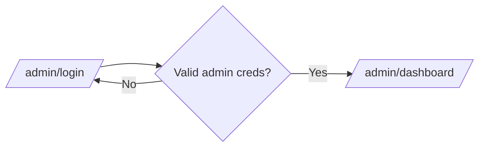
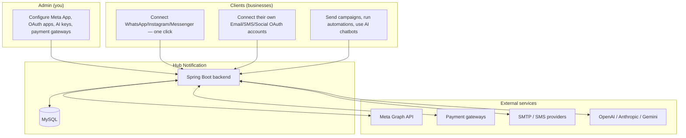
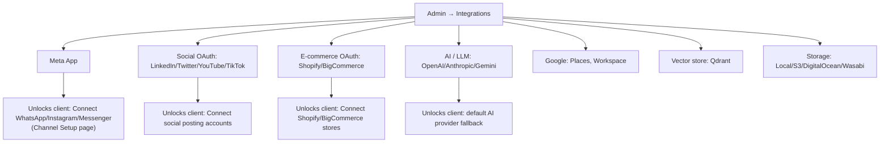
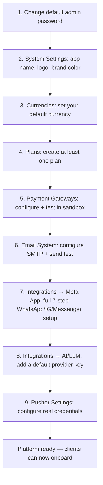

# Hub Notification — Admin Guide

This guide covers everything an **administrator** configures platform-wide — the settings that make client-side channel connections (WhatsApp, Email, SMS, Social, AI) actually work. If you haven't read it, do the **Integrations** section (§6) first — almost nothing works for clients until that's done.

> Default seeded admin account: `admin@example.com` / `password` — **change this password immediately.**

---

## 1. Admin login

| Action | URL |
|---|---|
| Admin login | `https://hubnotification.srjhubnest.com/admin/login` |

Successful login redirects to **`/admin/dashboard`**. Admin and client logins are completely separate — an admin account cannot log in at `/login`, and vice versa.



---

## 2. How the platform fits together



**Key idea:** you configure *app-level* credentials once (a Meta Developer App, OAuth client IDs, AI provider keys, payment gateway keys). Every client then connects *their own* accounts through those apps — clients never see or need your raw API keys.

---

## 3. Client Management

`/admin/clients` — list, search, create, edit, suspend clients. Each client can have custom **branding** (`Admin/ClientBranding`) applied to their panel. Use **Impersonation** to log in *as* a client for support/debugging — it creates a clearly-flagged session you can exit back to your own admin account from (`/admin/impersonation/stop`).

---

## 4. Plans & Subscriptions

`/admin/plans` — create/edit pricing plans.

| Section | Fields |
|---|---|
| General | Name, slug, description, currency |
| Pricing | Monthly price, optional yearly price, trial days |
| Stripe integration | Stripe Monthly/Yearly Price IDs |
| Limits | Usage caps (messages/month, contacts, etc.) |
| Features | Marketing bullet list shown on pricing page |
| Status | Enabled / Popular / Featured |

`/admin/subscriptions` — see and manage every client's active subscription.

---

## 5. Payments

`/admin/payment-gateways` — enable and configure the gateways clients' subscription payments run through.

| Gateway | Key credential fields |
|---|---|
| Stripe | Publishable key, Secret key, Webhook secret |
| PayPal | Publishable/Client ID, Secret |
| Razorpay | Key ID, Key Secret |
| Cashfree | App ID, Secret Key |
| Square | Location ID, Access Token |
| Tap, Mollie, Mercado Pago | Secret key only |
| Paystack, Xendit, Paymob, MyFatoorah | Provider-specific keys |

Each gateway has separate **Test** and **Live** credential sets plus a Test/Live mode toggle — configure and verify in Test mode before flipping to Live. Webhook endpoints (already wired, just point the provider's dashboard at them):

```
/webhooks/stripe        /webhooks/paypal      /webhooks/razorpay
/webhooks/cashfree      /webhooks/tap         /webhooks/paystack
/webhooks/xendit        /webhooks/paymob      /webhooks/myfatoorah
/webhooks/mollie        /webhooks/square      /webhooks/mercadopago
```

`/admin/transactions` — full payment/transaction ledger across all clients. `/admin/coupons` and `/admin/tax-rates` — discount codes and regional tax rules.

---

## 6. Integrations — the most important page

`/admin/integrations` — every third-party credential the platform needs, grouped by category. **This is what unlocks client-side channel connections.**



### 6.1 Meta App (WhatsApp / Instagram / Messenger) — do this first

| Field | Notes |
|---|---|
| App ID | From your Meta Developer App |
| App Secret | From your Meta Developer App |
| System User Token | Permanent token for WhatsApp Cloud API calls |
| Verify Token | Your own arbitrary string, used in the webhook URL |
| Embedded Signup Config ID (WhatsApp) | From Facebook Login for Business product |
| Embedded Signup Config ID (Instagram/Messenger) | Separate config, shared by both |

**Step-by-step (also shown in-app on the Integrations → Meta App page):**

1. **Create the Meta App** at [developers.facebook.com](https://developers.facebook.com) → copy **App ID** and **App Secret** into this page.
2. **WhatsApp Business API**: create a System User with **ADMIN** role in Meta Business Settings → generate a **permanent token** with `whatsapp_business_management`, `whatsapp_business_messaging`, `business_management` permissions → paste as **System User Access Token**. Set the WhatsApp webhook callback URL to:
   ```
   https://yourdomain.com/webhooks/whatsapp/{VERIFY_TOKEN}
   ```
3. **Embedded Signup**: add the **"Facebook Login for Business"** product to your Meta App → create **two** Configurations:
   - One scoped to WhatsApp permissions → copy its `config_id` into **Embedded Signup Config ID (WhatsApp)**.
   - One scoped to `instagram_basic`, `instagram_manage_messages`, `pages_messaging`, `pages_manage_metadata`, `pages_read_engagement`, `pages_show_list` → copy into **Embedded Signup Config ID (Instagram/Messenger)**.
   - Add OAuth redirect URI: `https://yourdomain.com/app/inbox/setup`
4. **Instagram DMs webhook**: `https://yourdomain.com/webhooks/meta/{VERIFY_TOKEN}`, subscribe fields: `messages`, `messaging_postbacks`, `messaging_optins`, `message_deliveries`, `message_reads`.
5. **Messenger DMs webhook**: same URL and fields as step 4.
6. **Facebook/Instagram social *posting*** (separate from DMs): add the plain **"Facebook Login"** product, redirect URI `https://yourdomain.com/auth/facebook/callback`, permissions `pages_manage_posts`, `pages_read_engagement`, `pages_show_list`, `instagram_basic`, `instagram_content_publish`, `public_profile`, `email`.
7. **Go Live**: switch the Meta App from Development to Live mode, request Advanced Access for the permissions above, and add Privacy Policy + Terms of Service URLs (Meta requires these before Live mode).

Once saved, every client on the platform can click **Connect WhatsApp / Instagram / Messenger** on their Channel Setup page and complete the one-click Embedded Signup flow — no further admin action needed per-client.

### 6.2 Social OAuth (posting accounts)

Standard OAuth app credentials — Client ID + Client Secret for each of **LinkedIn**, **Twitter/X**, **YouTube**, **TikTok** (TikTok uses "Client Key" instead of Client ID). Create an app in each provider's developer console, set the redirect URI to `https://yourdomain.com/app/social/accounts/callback/{network}`, and paste the credentials here.

### 6.3 E-commerce OAuth

Client ID + Secret for **Shopify** and **BigCommerce** (WooCommerce typically connects without OAuth, via a store-generated key).

### 6.4 AI / LLM providers (platform default)

Optional platform-level API keys for **OpenAI**, **Anthropic**, **Gemini** — used as a fallback/default; clients can still bring their own keys on their AI Providers page.

### 6.5 Storage

Choose where uploaded media lives: **Local disk** (default, no config), **Amazon S3**, **DigitalOcean Spaces**, or **Wasabi** — each needs Key, Secret, Region, Bucket (+ Endpoint for DO/Wasabi). Use **Set as default** to switch the active backend.

### 6.6 Google

**Google Places** (API key, powers the Leads Scraper's location search) and **Google Workspace** (Client ID/Secret/Refresh Token, for Workspace-integrated features).

### 6.7 Vector store (Qdrant)

URL + optional API key — backs the AI Knowledge Base's semantic search.

Every provider card shows a **Configured / Not Set** badge, a **Test** button to verify credentials live, and (for storage) **Set as default**. An **Audit Log** (`/admin/integrations/audit-log`) tracks every credential change.

---

## 7. Pusher Settings (realtime)

`/admin/pusher-settings` — powers live typing indicators and real-time message updates in the client Inbox.

| Field | |
|---|---|
| App ID | |
| App Key | |
| App Secret | |
| Cluster | e.g. `mt1`, `ap2` |
| Enabled | toggle |

> **Known issue on this deployment:** the shared props sent to the frontend currently hardcode `key: "whatsmine-key"` and `enabled: true` regardless of what's saved here, instead of reading the real configured values — this is why the browser console shows a repeating WebSocket connection error. Fixing it requires wiring `DefaultGlobalPropsProvider.java` (around line 137) to read from this settings table instead of a hardcoded placeholder. It doesn't block core functionality (messaging, campaigns, etc. all work over plain HTTP) — only live/realtime UI updates are affected until fixed.

Use **Test connection** after saving to confirm before relying on it.

---

## 8. Email System

Two tabs at `/admin/settings` (Email System section):

- **Update SMTP** — unlike the client's single SMTP config, admin can save **multiple** SMTP configurations and switch which one is **Active**. This is the SMTP used for system emails (invites, password resets, invoices). Same fields as the client Email Server page (host, port, encryption, username, password, from email/name). Always **Send test email** before activating.
- **Email Templates** — edit the HTML content of every system email (invite, password reset, invoice, etc.) with `{{placeholder}}` variables, a live preview iframe, and its own test-send.

---

## 9. CMS / Landing Page

- `/admin/landing-page` — edit the public marketing homepage content.
- `/admin/cms-pages` — manage standalone pages (Privacy Policy, Terms, etc.), served publicly at `/p/{slug}`.

---

## 10. System Settings

`/admin/settings` — three tabs:

1. **General** — App name, tagline, support email, primary brand color, logo & favicon upload.
2. **Firebase** — API key, Auth Domain, Project ID, App ID — enables Firebase-based social/phone login on the client login page.
3. **Advanced** — free-form key/value settings grid (grouped, with a secret/masked flag per row) for anything not covered by a dedicated page.

---

## 11. Other admin areas

| Page | URL | Purpose |
|---|---|---|
| Currencies | `/admin/currencies` | Add/edit currencies, exchange rates, set default |
| Roles & Permissions | `/admin/roles-permissions` | Fine-grained admin role management |
| License | `/admin/license` | Activate/deactivate license, check for & apply updates |
| Locales / Translations | `/admin/locales` | Manage supported languages & translation strings |
| Cron Setup | `/admin/cron-setup` | Instructions for the server-level cron job that drives scheduled campaigns/automations |
| Queue | `/admin/queue` | Monitor background job queue health |
| AI Dashboard | `/admin/ai` | Platform-wide AI usage/cost overview |
| Audit Log | `/admin/audit-logs` | Platform-wide admin action history |
| Support Tickets | `/admin/support-tickets` | Respond to client support tickets |
| Users | `/admin/users` | Manage admin user accounts themselves |

---

## Recommended first-run checklist


