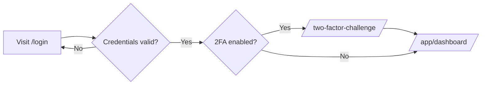
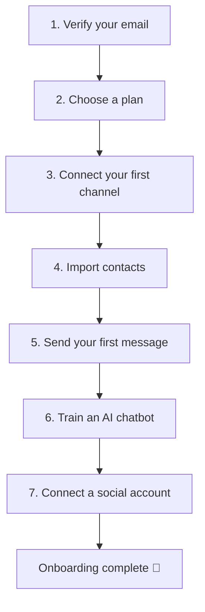
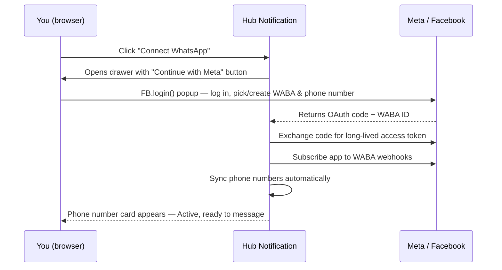
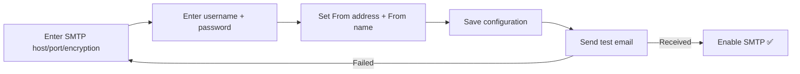
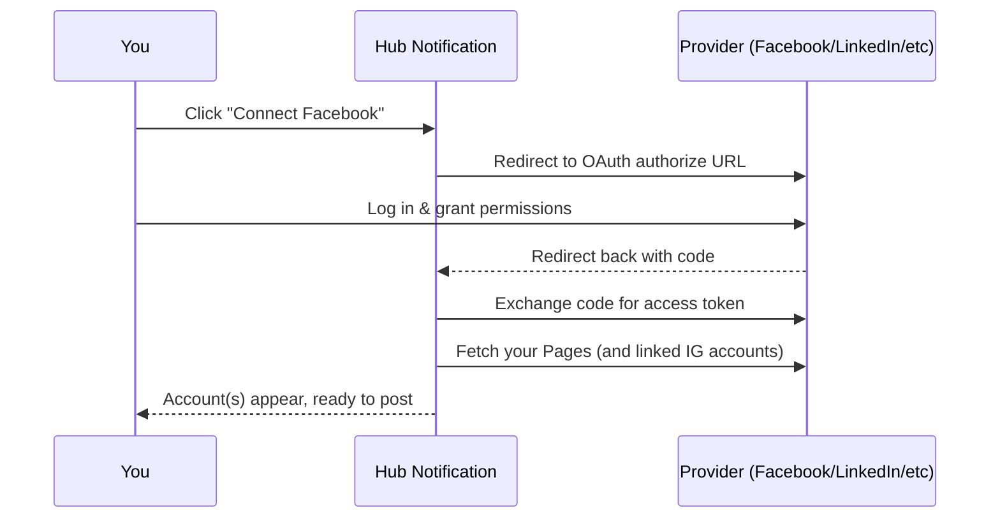
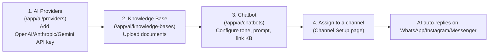

# Hub Notification — Client / User Guide

This guide walks a **client (business user)** through everything from first login to connecting every messaging channel the platform supports. It's written against the live deployment at `https://hubnotification.srjhubnest.com`, but every route works the same on any deployment — just swap the domain.

> Default seeded test account: `client@example.com` / `password` — **change this password on first login.**

---

## 1. Logging in

| Action | URL |
|---|---|
| Client login | `https://hubnotification.srjhubnest.com/login` |
| Register a new account | `https://hubnotification.srjhubnest.com/register` |
| Forgot password | `/forgot-password` |

After login you land on **`/app/dashboard`**. If your account has 2FA enabled, you'll be sent to `/two-factor-challenge` first.

---

## 2. First-time setup: the Onboarding checklist

New accounts see a 7-step onboarding wizard (`/onboarding`). Each step auto-detects completion; you can also jump straight to the linked page.

| # | Step | Takes you to |
|---|---|---|
| 1 | Verify your email | (automatic) |
| 2 | Choose a plan | `/pricing` |
| 3 | Connect your first messaging channel | Channel Setup (`/app/inbox/setup`) |
| 4 | Import or add your first contacts | `/app/contacts` |
| 5 | Send your first message | New campaign (`/app/campaigns/create`) |
| 6 | Train an AI chatbot | `/app/ai/chatbots` |
| 7 | Connect a social media account | `/app/social/accounts` |

---

## 3. Workspace & Team

- **Workspaces** (`/app/workspaces`) — a client can belong to / own multiple workspaces; each workspace has its own contacts, channels, and data.
- **Team** (`/team`) — invite or add teammates.

| Role | Can do |
|---|---|
| **Administrator** | Everything, including managing the team and billing |
| **Staff** | Everything except team/billing management |

Two ways to add someone:
1. **Invite by email** — sends an email invite; they set their own password.
2. **Add member** — you set their name/email/password directly (no invite email).

---

## 4. Contacts, Segments & Inbox

- **Contacts** (`/app/contacts`) — your CRM list. Import via CSV or add manually.
- **Segments** (`/app/segments`) — saved filters over contacts, used for targeted campaigns.
- **Inbox** (`/app/inbox`) — the unified conversation view across every connected channel (WhatsApp, Instagram DM, Messenger). Includes **Canned Replies** and **Labels** for organizing conversations.

---

## 5. Connecting Channels

This is the core of the platform. There are **five distinct places** to connect a channel — don't confuse them:

| Channel | Where to connect | Type |
|---|---|---|
| WhatsApp Business | Channel Setup (`/app/inbox/setup`) | Meta Embedded Signup (one-click OAuth) |
| Instagram DMs | Channel Setup (`/app/inbox/setup`) | Meta Embedded Signup |
| Facebook Messenger | Channel Setup (`/app/inbox/setup`) | Meta Embedded Signup |
| Email (for campaigns) | `/app/broadcasts/email-server` | Manual SMTP credentials |
| SMS (for campaigns) | `/app/broadcasts/sms-gateways` | Manual provider API keys |
| Social **posting** accounts | `/app/social/accounts` | OAuth (separate from Inbox DMs) |

> If any "Connect" button fails with *"credentials are not configured, contact your administrator"* — that's expected. Meta / OAuth / AI provider credentials are set up once, platform-wide, by an **admin** (see the Admin Guide, section 6). You cannot fix this yourself as a client.

### 5.1 WhatsApp / Instagram / Messenger (Meta Embedded Signup)

Go to **Channel Setup** → `/app/inbox/setup`. All three Meta channels use the same one-click flow — no manual API tokens.

Steps:
1. Click **Connect WhatsApp** (or **Connect Messenger** / **Connect Instagram**) at the top of the Channel Setup page.
2. In the drawer, click **"Continue with Meta – WhatsApp"**.
3. Log into your Facebook/Meta Business account in the popup, and select or create the WhatsApp Business Account (WABA) and phone number you want to use.
4. On success, a card appears showing your WABA, its phone number(s), quality rating, and name-approval status — no manual token entry required.
5. Per phone number you can:
   - **Sync from Meta** — refresh number status.
   - **Change display name** — submit a new business display name for approval.
   - **Assign an AI chatbot** — pick one of your chatbots (§5.5) to auto-reply on this number.
6. Use **Re-register webhook** if messages stop arriving.

**After connecting**, set up:
- **Templates** (`/app/whatsapp/templates`) — pulls your Meta-approved message templates; also lets you sync new ones and upload media.
- **Auto-Replies** (`/app/whatsapp/auto-replies`) — rules triggered by `keyword`, `welcome`, `away`, or `out_of_hours`, replying with text, a template, or media.
- **Chat Widget** (`/app/whatsapp/widget`) — an embeddable "Chat on WhatsApp" button for your own website (separate from the Business API — this just deep-links to WhatsApp). Configure greeting message, button color, position, and allowed domains, then embed the generated `<script>` snippet.

### 5.2 Email (SMTP)

Go to **`/app/broadcasts/email-server`**.

| Field | Example |
|---|---|
| Host | `smtp.gmail.com` |
| Port | `587` |
| Encryption | `tls` / `ssl` / `none` |
| Username | `your@email.com` |
| Password | (app password, not your normal login password for Gmail) |
| From email | `noreply@yourdomain.com` |
| From name | `Your Company` |

The page has a built-in setup guide for **Gmail/Google Workspace (App Passwords)**, **SendGrid**, **Mailgun**, and **Amazon SES**. Always click **Send test email** before enabling.

### 5.3 SMS Gateways

Go to **`/app/broadcasts/sms-gateways`**. Pick a provider card, fill in its credentials, optionally mark it as default, and save. Each card has its own setup guide.

| Provider | Fields |
|---|---|
| Twilio | Account SID, Auth Token, Twilio Number |
| Vonage (Nexmo) | API Key, API Secret |
| MessageBird | API Key |
| Plivo | Auth ID, Auth Token, From/Sender ID |
| Telnyx | API Key, From number, Messaging Profile ID |
| Infobip | API Key, Base URL, Sender |
| ClickSend | Username, API Key, From |
| Fast2SMS (India) | API Key, Sender ID, Route |
| Amazon SNS | Access Key, Secret, Region, Sender ID |
| SMSBD / RevE / BulkSMSBD / SMS.net.bd / MimSMS (Bangladesh) | Provider-specific API credentials |

### 5.4 Social Media (posting accounts)

Go to **`/app/social/accounts`** — this is for **posting/scheduling content** (separate from WhatsApp/Instagram/Messenger DMs above).

Supported networks: **Facebook, Instagram, LinkedIn, Twitter/X, YouTube, TikTok**. Click **Connect {Network}**, log in, and every Facebook Page you manage (plus linked Instagram Business accounts) is connected automatically. Use **Disconnect** to revoke.

Once connected, use:
- **Composer** (`/app/social/composer`) — write and publish/schedule a post, with optional AI-assisted generation.
- **Posts** (`/app/social/posts`) — manage scheduled/published posts.
- **Calendar** (`/app/social/calendar`) — calendar view of scheduled content.

### 5.5 AI Chatbot & Knowledge Base

Three linked pages under **AI**:

1. **AI Providers** (`/app/ai/providers`) — add your own API key for **OpenAI**, **Anthropic**, or **Gemini**, and pick a default model per provider (e.g. `gpt-4o-mini`, `claude-3-haiku-20240307`, `gemini-1.5-flash`).
2. **Knowledge Bases** (`/app/ai/knowledge-bases`) — create a KB, upload/add documents (FAQs, product info, policies). Reindex after edits.
3. **Chatbots** (`/app/ai/chatbots`) — create a chatbot; configure:
   - **Tone**: professional / friendly / formal / casual
   - **Knowledge Base**: link one, or none
   - **System prompt**: custom instructions
   - **Fallback reply**: shown when it can't answer
   - **Max context chunks**: how much KB content it pulls per reply (1–20)
   - Test it live in the built-in **Playground** before going live.
4. Go back to **Channel Setup** (`/app/inbox/setup`) and assign the chatbot to a specific WhatsApp/Instagram/Messenger number via the dropdown on that channel's card.

---

## 6. Campaigns / Broadcasting

`/app/campaigns` — create a broadcast to a contact list or segment via WhatsApp, Email, or SMS (whichever channels you've connected above). View delivery reports per campaign.

## 7. Automation Builder

`/app/automations` — a visual flow builder for multi-step automations (e.g. "new contact → wait 1 day → send WhatsApp template → if no reply → send SMS"). View run history and per-run logs.

## 8. Leads Scraper

`/app/leads` — scrape/generate leads by location and category (e.g. Google Maps-style search).

## 9. E-Commerce

`/app/ecommerce/*` — connect a **store** (Shopify / WooCommerce / BigCommerce via OAuth), then manage synced **products** and **orders**, and message customers about their orders directly from the order screen.

## 10. Billing & Subscription

- **Subscription** (`/app/subscription`) — your current plan, usage, upgrade/downgrade.
- **Billing** (`/app/billing`) — invoices and payment history.
- **Plans** (`/pricing`) — compare available plans.

## 11. Developer Tools

- **API Tokens** (`/app/api-tokens`) — generate personal access tokens for the REST API.
- **Webhooks** (`/app/webhooks`) — register your own endpoints to receive events.
- **API Docs** (`/app/api-docs`) — in-app API reference.
- **Media Library** (`/app/media`) — uploaded files/images used across campaigns and templates.

## 12. Support

`/app/support` — open and track support tickets with the platform admin.

## 13. Profile & Security

`/profile` — update your name/email/avatar, change password, manage **Two-Factor Authentication**, and view/revoke **active sessions** (useful if you ever suspect unauthorized access).

---

## Troubleshooting

| Symptom | Likely cause |
|---|---|
| "Connect WhatsApp" / social OAuth fails immediately with a config error | Admin hasn't configured Meta App / OAuth credentials yet — ask your admin (see Admin Guide §6). |
| WhatsApp messages not arriving in Inbox | Webhook may need re-registering — use **Re-register webhook** on the WABA card. |
| Template message rejected | Template not yet approved by Meta — check status on the Templates page. |
| Chatbot not replying | Confirm it's **enabled**, linked to the right Knowledge Base, and assigned to the channel on Channel Setup. |
| Campaign not sending | Check the relevant channel (Email/SMS/WhatsApp) is connected and, for Email/SMS, that you sent a successful test message first. |
